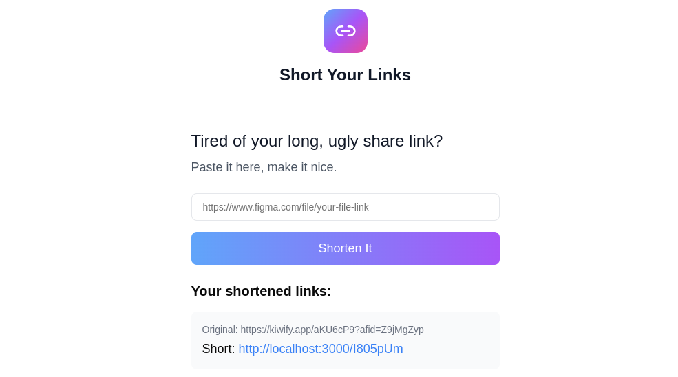

# URL Shortener

This is a modern, user-friendly URL shortener specifically designed for URLs. Built with Next.js and React, it offers a sleek interface for shortening URLs, with features like custom slugs and link history.



## Features

- Shorten url links with a single click
- Create custom slugs for memorable short links
- View and manage your link history
- Responsive design for desktop and mobile
- Client-side link storage for quick access to your shortened links
- Error handling and user-friendly error pages

## Tech Stack

- [Next.js](https://nextjs.org/) - React framework for production
- [React](https://reactjs.org/) - JavaScript library for user interfaces
- [Shadcn](https://shadcn.com/) - Component library for React
- [TypeScript](https://www.typescriptlang.org/) - Typed superset of JavaScript
- [Tailwind CSS](https://tailwindcss.com/) - Utility-first CSS framework
- [Zod](https://github.com/colinhacks/zod) - TypeScript-first schema validation
- [React Hook Form](https://react-hook-form.com/) - Performant, flexible and extensible forms
- [Lucide React](https://lucide.dev/) - Beautiful & consistent icon toolkit
- [Drizzle ORM](https://orm.drizzle.team/) - ORM
- [SQLite](https://www.sqlite.org/index.html) - Embedded SQL database engine

## Getting Started

### Prerequisites

- Node.js 20 or newer
- npm or yarn

### Installation

1. Clone the repository:

   ```bash
   git clone git@github.com:Santosl2/url-shortener.git
   cd url-shortener
   ```

2. Install the dependencies:

   ```bash
   npm install
   # or
   yarn install
   ```

3. Run the database migrations:

   ```bash
   npm run migrate
   # or
   yarn migrate
   ```

4. Run the development server:

   ```bash
   npm run dev
   # or
   yarn dev
   ```

5. Open [http://localhost:3000](http://localhost:3000) with your browser to see the result.

## Usage

1. Enter in the input field.
2. Click "Shorten It" to generate a short link.
3. Copy the generated short link to use or share.
4. View your link history below the form.

## Project Structure

```
url-shortener/
├── app/
│   ├── page.tsx
│   └── error.tsx
├── components/
│   ├── generated-links.tsx
│   ├── layout.tsx
│   ├── logo.tsx
│   ├── short-url-display.tsx
│   └── url-input.tsx
├── lib/
│   ├── schema.ts
│   ├── storage.ts
│   └── types.ts
├── public/
├── styles/
│   └── globals.css
├── README.md
├── next.config.js
├── package.json
└── tsconfig.json
```

## Contributing

Contributions are welcome! Please feel free to submit a Pull Request.

## License

This project is licensed under the MIT License - see the [LICENSE](LICENSE) file for details.

## Acknowledgments

- [Vercel](https://vercel.com) for the Next.js framework and hosting platform
- [Figma](https://www.figma.com) for inspiration
